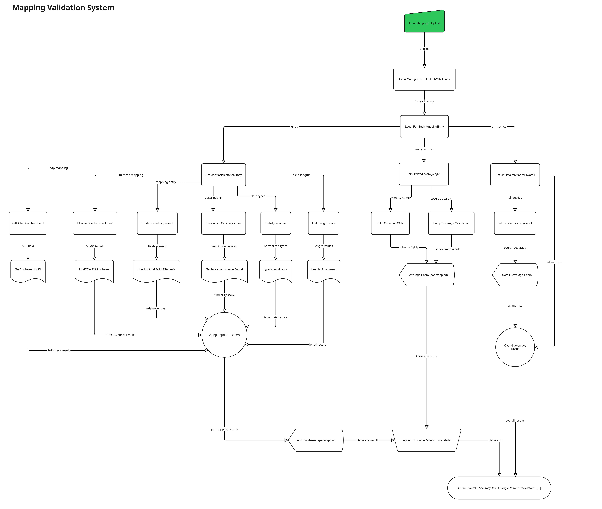
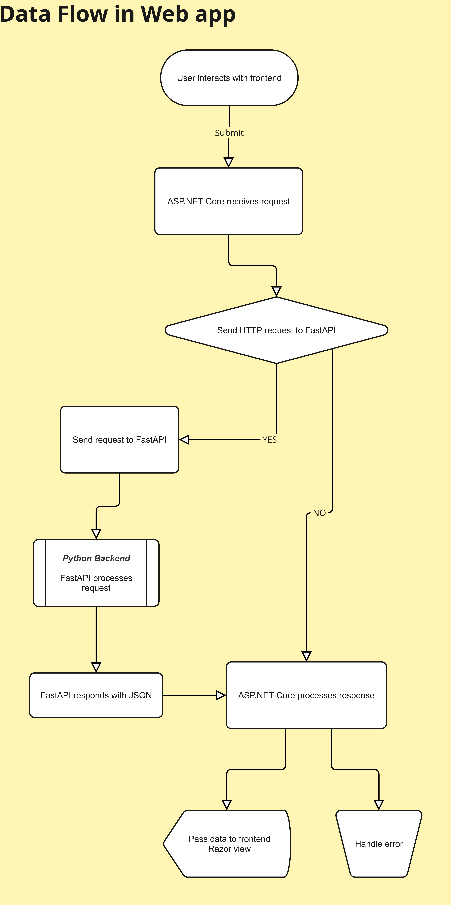

# SAP-MIMOSA Mapping Application

## Project Background
The goal of this project is to evaluate the use of generative AI in mapping the SAP PM data model to the MIMOSA CCOM data model. This increases interoperability between data models and enables easier data transfer.

## System Design
The system has two core functions:
1. Interact with generative AI to produce and improve mappings (a mapping is a pair of fields, one from SAP PM and one from MIMOSA CCOM, that are comparable).
2. Validate the output of these mappings to determine their likely correctness.

The system is accessed via a web interface, allowing users to generate new mappings from text prompts, store historical mappings, and search for field equivalents between SAP PM and MIMOSA CCOM.

## Introduction
SAP-MIMOSA mapping application is a comprehensive full-stack solution that facilitates the mapping between SAP Plant Maintenance (PM) and MIMOSA CCOM data models at both entity and field levels. The solution is built using an ASP.NET Core MVC frontend and a Python FastAPI backend, with integrated OpenAI models for intelligent mapping suggestions. The application not only enables manual and AI-assisted mapping creation but also provides mechanisms to assess AI-generated mapping accuracy, supporting continuous improvement and transparency.

---

## Codebase Structure

```
html-page/
├── Data/                       # (Not used in production) Scripts and schema/test files
├── ValidationAndMapping/       # Python backend for validation and mapping
│   ├── ScoreManager.py         # Returns mapping accuracy scores
│   ├── Models.py               # Data models for mappings and attributes
│   ├── Accuracy/               # Modules for field-to-field mapping accuracy
│   │   ├── DataType.py         # Data type comparability
│   │   ├── DescriptionSimilarity.py # Embedding-based description similarity
│   │   ├── FieldLength.py      # Field length comparison
│   │   ├── InfoOmitted.py      # Missing information checks
│   │   ├── SAPChecker.py       # SAP schema validation
│   │   └── MimosaChecker.py    # MIMOSA schema validation
├── WebApp/                     # ASP.NET Core MVC frontend
│   ├── app.py                  # FastAPI main server and endpoints
│   ├── ai_models.py            # OpenAIModel class for AI mapping
│   ├── Controllers/            # C# controllers
│   ├── Models/                 # WebApp-specific data models
│   ├── Views/                  # Razor views (cshtml)
│   └── wwwroot/                # Static assets
├── requirements.txt            # Python dependencies
├── main.py / app.py            # FastAPI entry point
├── test_*.py                   # Python test scripts
└── README.md                   # Project documentation
```

## Overview
The SAP-MIMOSA Mapping Application is designed to help industry specialists and organizations seamlessly integrate their SAP Plant Maintenance work order data with the MIMOSA work management system. It provides:
- **Data retrieval and management** from a JSON data store, supporting creation, update, and deletion of mapping records.
- **AI-powered search** that allows users to enter queries and generate mappings between SAP and MIMOSA CCOM data models.
- **User-friendly UI** with features like inline editing, creating mapping between two data models, check accuracy of either AI generated mappings or imported CSV file.

---

## Architecture

### Frontend (ASP.NET Core MVC)
- Built on ASP.NET Core MVC (C#), providing a robust and scalable web interface.
- Offers an interactive user experience with:
  - A searchable and filterable mapping table.
  - Inline editing.
  - Dedicated AI search box for intelligent mapping generation.
  - Success and error messages for all user operations.

### Backend (Python FastAPI)
- Developed with FastAPI for high performance and easy extensibility.
- Implements REST endpoints for all CRUD operations on mapping documents.
- Integrates with OpenAI’s GPT-4.1 and o3-mini for generating mapping suggestions based on user queries.
- Stores all mappings in a JSON file, ensuring persistence and easy backup.
- Store every single AI generated mapping in separate JSON file as a chronological data for analytics 
- Generates unique, incremental map IDs server-side for security and consistency.

---

## Key Features
- **Detailed Mapping Table:**
  - Displays SAP PM and MIMOSA CCOM field names, descriptions, data types, lengths, equivalents, and notes.
- **CRUD Operations:**
  - Create, edit, and delete mappings directly from the UI using intuitive controls.
- **AI-Assisted Mapping:**
  - Enter a query in the AI search box to receive mapping suggestions from the backend AI model. Suggestions are pre-filled in the creation form for review and editing.
  - Track changes and maintain version history for mappings.
- **Import/Export:** 
  - Enable import/export of mappings to/from CSV.
- **AI Mapping Accuracy Metrics:** 
  - Measure and display the accuracy of AI-generated mappings.
- **Manual Mapping:**
  - Users can manually create or edit mappings, ensuring flexibility for complex or unique scenarios.
- **Success & Error Feedback:**
  - Immediate feedback is provided after each operation, including the generated map ID for new mappings.
- **Robust Error Handling:**
  - All operations are validated, and user-friendly error messages are displayed in case of issues.

---

## Usage
- **Landing Page:**
  - Displays a detailed mapping table retrieved from the JSON data storage. Each row shows SAP PM and MIMOSA CCOM field details.
- **Editing and Creating:**
  - Use the “Edit”, “Create New Field”, and delete buttons to update, add, or remove mappings.
- **AI Assistant:**
  - Enter a mapping-related question or requirement into the AI search box. The AI assistant will generate a mapping, which you can review and further edit before saving.
- **Feedback Mechanism:**
  - Success messages are shown after each successful operation, and errors are clearly indicated.

---

## API Endpoints (Backend)

### AI Endpoints
- `POST /ask_AI` — Generate a mapping suggestion from a user query using OpenAI.
- `GET /system_message` — Get the system prompt used for AI mapping.

### Mapping Documents
- `GET /mappings` — Retrieve all mapping documents.
- `GET /mappings/{map_id}` — Retrieve a mapping document by its ID.
- `POST /mappings` — Create a new mapping document.
- `PUT /mappings/{map_id}` — Update a mapping document by its ID.
- `DELETE /mappings/{map_id}` — Delete a mapping document by its ID.

### Analytics & History
- `GET /fetchHistoricalData?createdDate=YYYY-MM-DDTHH:MM:SS` — Retrieve historical AI mapping data (optionally filtered by date).
- `POST /check_accuracy` — Submit mapping entries and receive accuracy metrics.


---

## Workflow
1. **Viewing Mappings:**
   - The landing page displays all mappings with advanced search and filter options.
2. **AI Mapping Generation:**
   - User enters a query in the AI search box.
   - The query is sent to the FastAPI backend (`/ask_openai`), which returns a mapping suggestion.
   - The suggestion is stored in temporary file and displayed in Create view with the form pre-filled.
3. **Creating/Editing Mappings:**
   - Users can review, edit, or accept the suggested mapping.
   - On submission, the mapping is sent to the backend for storage, and a success message (with map ID) is shown.
4. **Manual CRUD:**
   - Users can manually create, edit, or delete mappings at any time.

---

## Key Design Decisions
- **Unified Creation Workflow:**
  - AI-assisted mapping creation are handled by a controller and FastAPI endpoint methods and view.
- **Server-Side Map ID Generation:**
  - Map IDs are generated incrementally on the backend, ensuring uniqueness and preventing tampering.
- **Separation of Concerns:**
  - The frontend and backend communicate strictly via REST APIs, making the system modular and extensible.  
- **Security:**
  - All sensitive operations are validated and sanitized. Only the backend can generate or modify map IDs.
- **Extensibility:**
  - The architecture supports easy integration of new AI models, additional mapping types, or new data fields with minimal code changes.
- **AI Performance Assessment:**
  - The system can assess the accuracy of AI-generated mappings, supporting analytics and improvement.

---

## Future Improvements
- **Authentication & Authorization:** Restrict mapping management to authorized users.
- **User Feedback:** Allow users to rate mappings to improve AI performance.
- **Audit Logging:** Track all changes for compliance and traceability.

---

## Running the Application

### 1. Backend (Python FastAPI)
- Install dependencies:
  - Run the following command in your terminal or PowerShell to install the necessary packages: pip install fastapi uvicorn pydantic openai
  - To install and use the sentence-transformers library, which is used for generating sentence embeddings using pre-trained models, run command: pip install sentence-transformers

- Set your OpenAI API key as an environment variable (replace with your actual key):
  - Windows (Powershell):
    ```sh
    $env:OPENAI_API_KEY="your_api_key_here"
    ```
  - For Windows (Command Prompt)
    ```sh
    set OPENAI_API_KEY=your_api_key_here
    ```
  - Linux/macOS:
    ```sh
    export OPENAI_API_KEY=your_api_key_here
    ```
- (Optional) Adjust backend address in frontend if not using default.
- Run the FastAPI server:
  ```sh
  python main.py
  # or
  uvicorn main:app --reload
  ```

### 2. Frontend (ASP.NET Core MVC)
- Open the `WebApp` directory in Visual Studio or use the .NET CLI:
  ```sh
  dotnet build
  dotnet run
  ```
- The frontend expects the backend at `http://127.0.0.1:8000/` by default. Adjust as needed in `HomeController.cs`.

---

## API Usage Examples

### Generate Mapping Suggestion (AI)
```
POST /ask_openai
Content-Type: application/json
{
  "query": "Map SAP Functional Location to MIMOSA CCOM"
}
```
**Response:**
```
{
  "suggestion": {
    ...mapping fields...
  }
}
```

## Testing

### Python Backend
- Run tests (from project root):
  ```sh
  pytest
  ```
- Test files: `test_InfoOmmitted.py`, `test_MimosaChecker.py`, etc.

### .NET Frontend
- Use Visual Studio Test Explorer or `dotnet test`.

---

## Troubleshooting
- **CSV Import Issues:**
   - If you are unable to import a CSV file, double-check the header names and file formatting, it should match following header names: MIMOSA_EntityName, MIMOSA_FieldName, MIMOSA_DataType, MIMOSA_FieldLength, MIMOSA_Description, SAP_EntityName, SAP_Description, SAP_DataType, SAP_FieldLength, SAP_FieldName
- **Similarity Score Issues:**
   - If you are getting very low similarity scores, check that your field descriptions are detailed and accurate, that the correct models are being used for embedding and comparison and that you are using technical names for the table and field names i.e AUFK instead of order master data and AUFNR instead of order number.

---

## Validation criteria
- **Accuracy:** A total accuracy score is calculated by taking the metrics, SAP Similarity, MIMOSA Similarity, Description Similarity and Data type Similarity but not Table coverage and averaging their scores. 
- **SAP Similarity:** SAP similarity compares the SAP side of the mapping to to the schema to see if it is a valid field. It does this by comparing the fields generated to a json file containing all of the SAP PM tables and fields.
- **MIMOSA Similarity:** MIMOSA similarity compares the MIMOSA side of the mapping to to the schema to see if it is a valid field. It does this by comparing the fields against the xsd schema to find if entites exist and that all the fields are contained in the entities they are listed under, it then validates the data type and description against the stored values.
- **Description Similarity:** Description similarity compares the meaning of descriptions across a mapping to see if the fields are likely to contain similar information. It uses a language model to convert each description to a number that represents its meaning and compares these number to see how simmilar they are in meaning.
- **Data type Similarity:** DataType compares the data type between mapped fields to see if they are likely to be able to contain similar data. It does this by converting all know data types across SAP and MIMOSA schema to their base type i.e cct:TextType from MIMOSA is converted to a string. These base types are then compared to each other to see if they are the same i.e to prevent a number from matching to a string. 
- **Table Coverage:** Table coverage is a measure of how much of the base tables are covered by the the current mappings. At an overall level it gets the total number of fields that have a valid table name and the total number of fields for each valid table found and calculates a score with (total number of fields mapped/number of fields found across all tables found). At an single mapping level it performs this same check but only uses the table for that mapping i.e MANDT from table AUFK will only look for fields with table AUFK in the mappings generated, giving an individual table coverage metric. 

### Validation system architecture


### Web app architecture

---

## Future Improvements
- **Authentication & Authorization:** Restrict mapping management to authorized users.
- **User Feedback:** Allow users to rate mappings to improve AI performance.
- **Audit Logging:** Track all changes for compliance and traceability.
- **Per-Mapping AI Assistance:** Each mapping pair section can have its own AI assistant to improve individual mapping fields.
- **Semantic Search Validation:** Use semantic search algorithms for better mapping content validation.
- **Model Fine-Tuning:** Tune the generative AI model specifically for SAP and MIMOSA CCOM data models for more accurate responses.
- **Model Expansion:** Add more models to choose from.